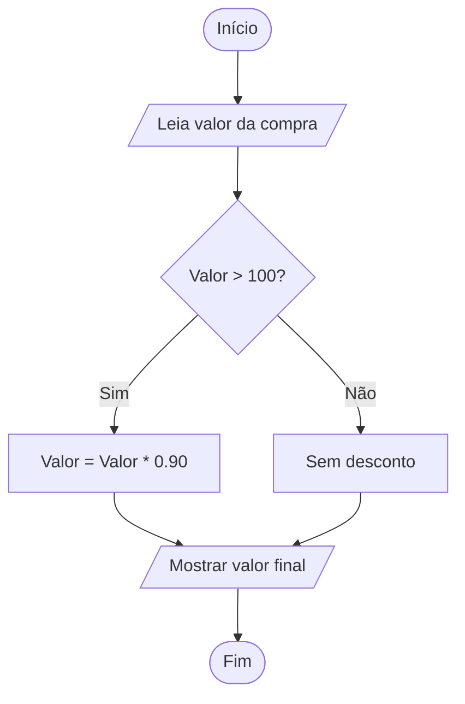

# Fluxograma - Desconto na Compra

```mermaid
flowchart TD
    A([Início]) --> B[/Leia valor da compra/]
    B --> C{Valor > 100?}

    C -->|Sim| D[Valor = Valor * 0.90]
    C -->|Não| E[Sem desconto]

    D --> F[/Mostrar valor final/]
    E --> F

    F --> G([Fim])
```