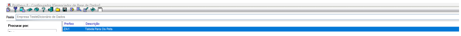
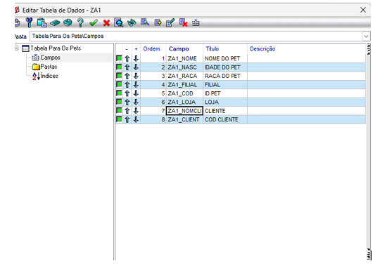
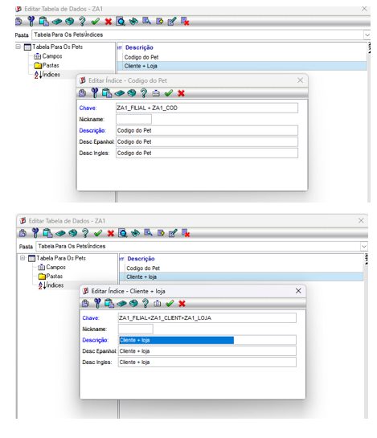
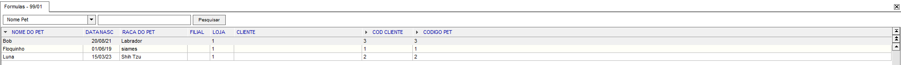

## Exercício 2 — Dicionário da Tabela ZA1

### SX2 — Tabela

### SX3 — Campos

### SIX — Índices

### SIX — Índices

# Exercício 2 – Tabela ZA1

## Desenvolvimento

Neste exercício realizei a configuração da tabela ZA1 (Pets) no dicionário de dados do Protheus.

Foram criados os campos necessários para o cadastro dos pets, além da configuração do índice principal da tabela. Após a criação da estrutura, validei se a tabela estava disponível no ambiente e pronta para ser utilizada pelo programa.

## Exercício 3 – CRUD com AxCadastro

Desenvolvi a rotina `STTIP001.PRW` utilizando a função `AxCadastro` para realizar as operações de cadastro da tabela ZA1.

Após compilar o programa no DevStudio, executei a rotina no Protheus e consegui incluir registros de teste. O cadastro foi exibido corretamente, permitindo incluir, alterar, visualizar e excluir os registros através da interface padrão do AxCadastro.

## Conclusão

Este módulo permitiu entender como criar uma tabela no dicionário de dados e utilizá-la em uma rotina ADVPL utilizando o AxCadastro, compreendendo na prática a integração entre o dicionário e a aplicação.